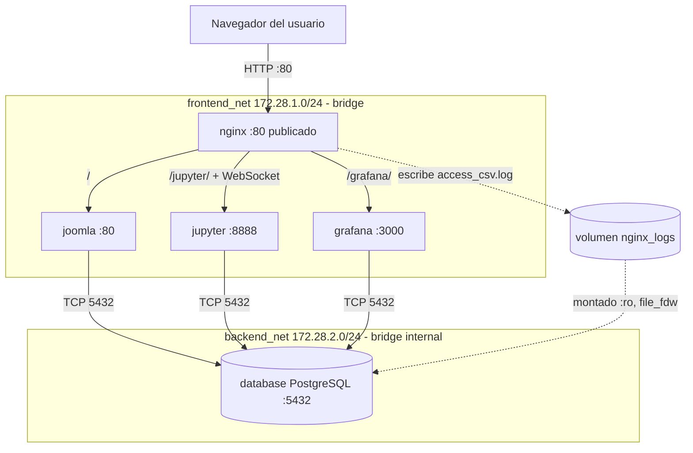

# Informe técnico – Parcial 2 Comunicaciones

**Integrantes:** _(nombres)_ · **Docente:** Ing. Andrés Julián Moreno M.Sc.

## Sección 1. Topología y flujo de información

### 1.1 Diagrama de arquitectura

| Contenedor | Imagen | Redes | Puerto interno | Publicado |
|---|---|---|---|---|
| nginx | nginx:alpine | frontend_net | 80 | **80:80** |
| joomla | joomla:latest | frontend_net, backend_net | 80 | no |
| database | postgres:16-alpine | backend_net | 5432 | no |
| jupyter | jupyter minimal-notebook (build) | frontend_net, backend_net | 8888 | no |
| grafana | grafana/grafana:latest | frontend_net, backend_net | 3000 | no |

`backend_net` está declarada con `internal: true`: Docker no crea reglas de salida/NAT hacia el exterior, por lo que `database` es inalcanzable desde fuera del clúster. Jupyter y Grafana se conectan también a `backend_net` porque consultan PostgreSQL directamente.

### 1.2 Mecanismo de recolección de logs
1. Cada petición HTTP que llega a Nginx se escribe en `/var/log/nginx/access_csv.log` (formato `csvlog`: fecha, IP, método, URI, estado, bytes, tiempo, host), dentro del volumen `nginx_logs`.
2. El contenedor `database` monta ese volumen en modo solo lectura. La extensión `file_fdw` define la tabla foránea `monitoring.nginx_access_raw`, y la vista `monitoring.v_access_logs` convierte tipos y clasifica por código y servicio.
3. Grafana (datasource provisionado en `datasource.yml`) y Jupyter (SQLAlchemy/psycopg2) ejecutan SQL sobre la vista; cada consulta lee el archivo en ese instante, por lo que los paneles reflejan el tráfico casi en tiempo real (refresco de 10 s).
4. El dashboard `joomla_logs.json` se carga automáticamente desde `/etc/grafana/provisioning/`.

## Sección 2. Análisis del modelo OSI

### Capa 7 – Aplicación
- **Cabeceras de Nginx:** `Host` conserva el nombre solicitado por el cliente (necesario para que Joomla/Jupyter generen URLs y validen el origen); `X-Forwarded-For` acumula la cadena de IPs de los clientes, ya que para el backend la IP de origen es la de Nginx; `X-Forwarded-Proto` informa si el cliente usó http o https.
- **HTTP Upgrade / WebSockets:** el kernel de Jupyter se comunica por WebSocket. El cliente envía `Upgrade: websocket` y `Connection: Upgrade`; Nginx usa HTTP/1.1 hacia el backend y reenvía ambas cabeceras (`map $http_upgrade $connection_upgrade`). El servidor responde `101 Switching Protocols` y la conexión TCP queda abierta bidireccional. Sin esto aparece "Kernel connection error".
- **PostgreSQL:** protocolo binario propio cliente/servidor sobre TCP: mensaje de inicio, autenticación (SCRAM-SHA-256), consultas (Query/Parse/Bind/Execute) y respuestas (RowDescription/DataRow/CommandComplete/ReadyForQuery).
- **Logs de Joomla/Nginx:** una línea por petición, campos separados por tabulador (fecha ISO-8601, IP, método, URI, estado, bytes, tiempo, host).

### Capa 4 – Transporte
- **Puertos TCP:** 80 (Nginx, único publicado con DNAT del host), 5432 (PostgreSQL), 8888 (Jupyter), 3000 (Grafana), 80 interno (Apache de Joomla).
- **Conexiones:** cada petición del navegador abre (o reutiliza con keep-alive) una conexión TCP con Nginx (SYN → SYN/ACK → ACK). Nginx abre otra conexión TCP independiente hacia el backend: son dos conexiones encadenadas. En esta configuración, al usar `proxy_pass` con variable, Nginx no mantiene un pool de conexiones upstream (para eso se requiere un bloque `upstream` con `keepalive`). Joomla (PHP, `pdo_pgsql`) abre por defecto una conexión TCP a PostgreSQL por cada petición PHP y la cierra al terminar; para pooling real se usaría `pconnect` o PgBouncer. Los WebSockets de Jupyter son conexiones TCP persistentes de larga duración (`proxy_read_timeout 86400s`). PostgreSQL atiende cada conexión con un proceso backend dedicado y puede manejar varias concurrentes (`max_connections`).

### Capa 3 – Red
- **Direccionamiento:** `frontend_net` 172.28.1.0/24 y `backend_net` 172.28.2.0/24; cada contenedor recibe una IP por red. Son dominios de difusión y subredes distintas: Nginx no tiene interfaz en `backend_net`, por lo que no puede alcanzar a `database`. Solo los contenedores multi-homed (joomla, jupyter, grafana) actúan de puente lógico entre ambas redes.
- **DNS embebido (127.0.0.11):** en redes definidas por el usuario, Docker inyecta en `/etc/resolv.conf` el resolvedor 127.0.0.11, que traduce nombres de servicio (`database`, `joomla`, `grafana`…) a la IP del contenedor en la red compartida. Por eso Nginx declara `resolver 127.0.0.11` y las aplicaciones usan `database:5432`.
- **Reenvío y NAT en el host:** el kernel tiene `net.ipv4.ip_forward=1`; Docker agrega reglas iptables/nftables (cadenas `DOCKER`, `DOCKER-ISOLATION`): DNAT del puerto 80 del host hacia Nginx, MASQUERADE para la salida de `frontend_net`, y reglas de aislamiento que impiden el tráfico entre redes distintas y bloquean el acceso externo a `backend_net` (internal).

### Capa 2 – Enlace de datos
- Cada red bridge crea un puente virtual Linux `br-<id>`. Cada contenedor tiene un extremo `eth0` de un par **veth**; el otro extremo (`vethXXXX`) se conecta como puerto al puente, que funciona como un switch L2 aprendiendo direcciones MAC.
- **ARP:** cuando Nginx quiere enviar a la IP de Joomla (misma subred), emite un ARP request en broadcast ("¿quién tiene 172.28.1.x?"); Joomla responde con su MAC y el resultado queda en la caché ARP (`ip neigh`). El bridge reenvía las tramas según su tabla MAC (`bridge fdb`).

## Sección 3. Guía de verificación y demostración

1. **Levantar:** `cp .env.example .env && docker compose up -d`; esperar a que `docker compose ps` muestre todo `healthy`.
2. **Joomla vía Nginx:** abrir `http://localhost/`, navegar varias páginas y entrar a `/administrator` (genera peticiones 200/302/404; probar una URL inexistente para ver 404).
3. **Comprobar la tubería de logs:**
   `docker exec database psql -U joomla -d joomla_db -c "SELECT status, count(*) FROM monitoring.v_access_logs GROUP BY 1;"`
4. **Grafana:** abrir `http://localhost/grafana/` (admin / admin12345). El dashboard "Joomla - Tráfico y Logs" aparece como página de inicio con 4 paneles que reflejan las peticiones del paso 2.
5. **Jupyter:** abrir `http://localhost/jupyter/?token=parcial2026`, entrar a `work/analisis_datos.ipynb` y ejecutar *Run → Run All Cells*: debe imprimir la versión de PostgreSQL, las tablas de Joomla y las gráficas de tráfico (esto demuestra además que el WebSocket del kernel funciona).
6. **Evidencias de red:** `docker network inspect parcial-redes_backend_net`, `docker exec nginx cat /etc/resolv.conf`, `ip link show type veth`, `bridge link`, `docker exec nginx ip neigh`, y `docker exec nginx ping -c1 database` (debe fallar: aislamiento).