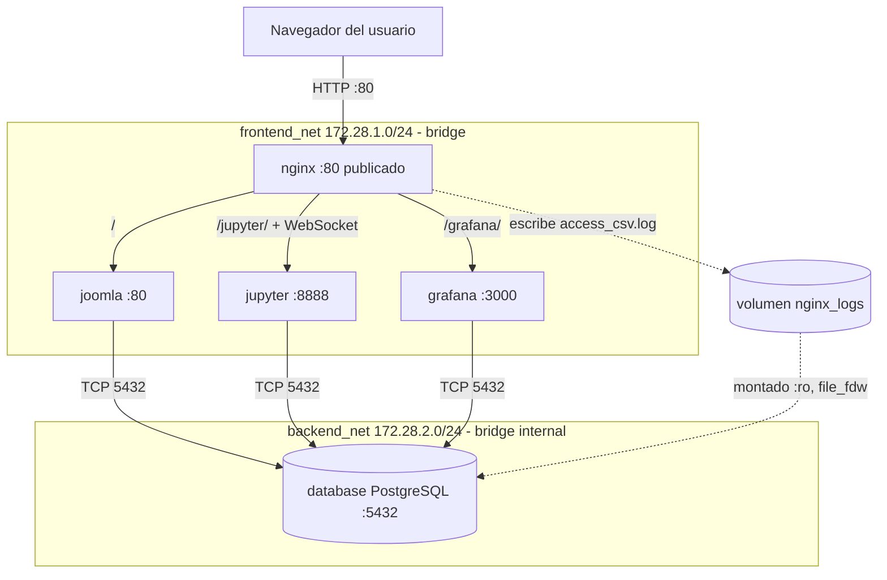

# Informe técnico – Parcial 2 Comunicaciones

**Integrantes:** _(nombres)_ · **Docente:** Ing. Andrés Julián Moreno M.Sc.
**Programa:** Ingeniería Mecatrónica · **Asignatura:** Comunicaciones

---

## Tabla de contenido

1. [Introducción y objetivos](#introducción-y-objetivos)
2. [Sección 1. Topología y flujo de información](#sección-1-topología-y-flujo-de-información)
3. [Sección 2. Análisis del modelo OSI](#sección-2-análisis-del-modelo-osi)
4. [Sección 3. Guía de verificación y demostración](#sección-3-guía-de-verificación-y-demostración)
5. [Sección 4. Decisiones de diseño, seguridad y limitaciones](#sección-4-decisiones-de-diseño-seguridad-y-limitaciones)
6. [Sección 5. Solución de problemas frecuentes](#sección-5-solución-de-problemas-frecuentes)
7. [Conclusiones](#conclusiones)

---

## Introducción y objetivos

Este proyecto despliega, con un único comando (`docker compose up -d`), la infraestructura web de una organización académica e industrial compuesta por cinco servicios: un proxy inverso (**Nginx**), un CMS (**Joomla**), una base de datos relacional (**PostgreSQL 16**), un entorno de ciencia de datos (**Jupyter**) y una plataforma de monitoreo (**Grafana**).

Los objetivos son:

- **Despliegue desatendido (zero-touch):** que tras `cp .env.example .env && docker compose up -d` todos los servicios queden saludables sin intervención manual.
- **Segmentación de red:** separar la red de cara al usuario (`frontend_net`) de la red de datos (`backend_net`), de modo que la base de datos no sea alcanzable desde el exterior.
- **Observabilidad automática:** que Grafana muestre paneles con estadísticas de tráfico de Joomla desde el primer arranque, y que Jupyter tenga un cuaderno listo para ejecutar.
- **Análisis riguroso del modelo OSI:** justificar el comportamiento de las capas 7, 4, 3 y 2 en la solución, con evidencias reproducibles.

---

## Sección 1. Topología y flujo de información

### 1.1 Diagrama de arquitectura



### 1.2 Inventario de contenedores

| Contenedor | Imagen | Redes | Puerto interno | Publicado | Rol |
|---|---|---|---|---|---|
| nginx | nginx:alpine | frontend_net | 80 | **80:80** | Proxy inverso y punto único de entrada; genera el log de accesos |
| joomla | joomla:latest | frontend_net, backend_net | 80 | no | CMS; persiste en PostgreSQL |
| database | postgres:16-alpine | backend_net | 5432 | no | Motor relacional; fuente de datos para Joomla, Grafana y Jupyter |
| jupyter | jupyter minimal-notebook (build) | frontend_net, backend_net | 8888 | no | Análisis de datos con cuaderno precargado |
| grafana | grafana/grafana:latest | frontend_net, backend_net | 3000 | no | Dashboards provisionados automáticamente |

`backend_net` está declarada con `internal: true`: Docker no crea reglas de salida/NAT hacia el exterior, por lo que `database` es inalcanzable desde fuera del clúster. Jupyter y Grafana se conectan también a `backend_net` porque consultan PostgreSQL directamente.

### 1.3 Mapa de puertos y rutas

| Ruta pública | Destino interno | Protocolo | Observaciones |
|---|---|---|---|
| `http://localhost/` | `joomla:80` | HTTP/1.1 | Portal y `/administrator` |
| `http://localhost/jupyter/` | `jupyter:8888` | HTTP/1.1 + WebSocket | Requiere cabeceras `Upgrade`/`Connection` |
| `http://localhost/grafana/` | `grafana:3000` | HTTP/1.1 | Grafana configurado con subruta (`root_url` / `serve_from_sub_path`) |
| _(no expuesto)_ | `database:5432` | PostgreSQL wire protocol sobre TCP | Solo accesible desde `backend_net` |

### 1.4 Volúmenes y persistencia

| Volumen / montaje | Tipo | Contenedor(es) | Propósito |
|---|---|---|---|
| `/var/lib/postgresql/data` | Volumen nombrado | database | Persistencia de las bases de datos |
| Assets de Joomla | Volumen nombrado | joomla | Persistencia de archivos subidos y configuración |
| `nginx_logs` | Volumen nombrado | nginx (escritura), database (solo lectura) | Canal de transporte de logs hacia PostgreSQL |
| `./jupyter/notebooks` → `/home/jovyan/work` | Bind mount | jupyter | Cuaderno `analisis_datos.ipynb` precargado |
| `./grafana/provisioning` → `/etc/grafana/provisioning` | Bind mount | grafana | Datasource y dashboard declarativos |
| `./nginx/default.conf` | Bind mount | nginx | Configuración del proxy |

### 1.5 Orden de arranque y healthchecks

Para evitar condiciones de carrera, `database` define un healthcheck con `pg_isready -U $$POSTGRES_USER`, y los servicios que dependen de ella (`joomla`, `jupyter`, `grafana`) usan `depends_on` con `condition: service_healthy`. El orden efectivo es:

1. `database` arranca, inicializa el clúster, ejecuta los scripts de inicialización (esquema `monitoring`, extensión `file_fdw`, tabla foránea y vista) y pasa a `healthy`.
2. `joomla`, `jupyter` y `grafana` inician cuando la base de datos acepta conexiones; Joomla realiza su instalación/migración automática contra PostgreSQL.
3. `nginx` inicia al final, de modo que cuando el puerto 80 responde, los backends ya están listos para recibir tráfico.

### 1.6 Mecanismo de recolección de logs

1. Cada petición HTTP que llega a Nginx se escribe en `/var/log/nginx/access_csv.log` (formato `csvlog`: fecha, IP, método, URI, estado, bytes, tiempo, host), dentro del volumen `nginx_logs`. Se registra en Nginx (y no en Joomla) porque es el único punto por el que pasa **todo** el tráfico, incluido el de Jupyter y Grafana.
2. El contenedor `database` monta ese volumen en modo solo lectura. La extensión `file_fdw` define la tabla foránea `monitoring.nginx_access_raw`, y la vista `monitoring.v_access_logs` convierte tipos y clasifica por código y servicio.
3. Grafana (datasource provisionado en `datasource.yml`) y Jupyter (SQLAlchemy/psycopg2) ejecutan SQL sobre la vista; cada consulta lee el archivo en ese instante, por lo que los paneles reflejan el tráfico casi en tiempo real (refresco de 10 s).
4. El dashboard `joomla_logs.json` se carga automáticamente desde `/etc/grafana/provisioning/`, declarado por `dashboard.yml`.

**Resumen del flujo de datos:**

```
Petición HTTP → Nginx → access_csv.log (volumen) → file_fdw → vista SQL → Grafana / Jupyter
```

**Ventajas de este diseño:** no requiere agentes adicionales (Loki, Promtail, Filebeat), el log es consultable con SQL estándar y reutiliza el servicio de PostgreSQL ya exigido. **Limitación:** `file_fdw` relee el archivo completo en cada consulta, por lo que con volúmenes de log muy grandes convendría rotar el archivo o cargarlo en una tabla real de forma periódica.

### 1.7 Recorrido completo de una petición (ejemplo)

Cuando el usuario abre `http://localhost/` ocurre lo siguiente:

1. El navegador resuelve `localhost` y abre una conexión TCP al puerto 80 del host.
2. El kernel del host aplica la regla DNAT de Docker y redirige el paquete a la IP de Nginx en `frontend_net` (puerto 80).
3. Nginx recibe la petición, selecciona el bloque `location /` y abre una nueva conexión TCP hacia `joomla:80` (resolviendo `joomla` mediante el DNS embebido 127.0.0.11), añadiendo `Host`, `X-Forwarded-For` y `X-Forwarded-Proto`.
4. Apache/PHP en Joomla procesa la petición; si necesita datos, abre una conexión TCP a `database:5432` por `backend_net`, autentica y ejecuta consultas.
5. Joomla responde a Nginx, que reenvía la respuesta al navegador y escribe una línea en `access_csv.log`.
6. En el siguiente refresco (≤10 s), Grafana consulta la vista `monitoring.v_access_logs` y la nueva petición aparece en los paneles.

---

## Sección 2. Análisis del modelo OSI

### Capa 7 – Aplicación

#### Cabeceras de Nginx

| Cabecera | Valor típico | Función |
|---|---|---|
| `Host` | `$host` / `$http_host` | Conserva el nombre solicitado por el cliente, necesario para que Joomla/Jupyter generen URLs absolutas correctas y validen el origen. |
| `X-Real-IP` | `$remote_addr` | IP directa del cliente que se conectó a Nginx. |
| `X-Forwarded-For` | `$proxy_add_x_forwarded_for` | Acumula la cadena de IPs de los clientes: para el backend, la IP de origen del paquete es la de Nginx, así que esta cabecera es la única forma de conocer al cliente real. |
| `X-Forwarded-Proto` | `$scheme` | Informa si el cliente usó `http` o `https`, para que las aplicaciones construyan enlaces con el esquema correcto. |

#### HTTP Upgrade / WebSockets

El kernel de Jupyter se comunica por WebSocket. El handshake es una petición HTTP/1.1 normal que solicita cambiar de protocolo:

```
GET /jupyter/api/kernels/<id>/channels HTTP/1.1
Host: localhost
Upgrade: websocket
Connection: Upgrade
Sec-WebSocket-Key: ...
Sec-WebSocket-Version: 13
```

`Upgrade` y `Connection` son cabeceras *hop-by-hop*: por defecto Nginx **no** las reenvía al backend. Por eso la configuración usa HTTP/1.1 hacia el upstream (`proxy_http_version 1.1`), reenvía `Upgrade $http_upgrade` y calcula `Connection` con un `map $http_upgrade $connection_upgrade` (valor `upgrade` si hay cabecera `Upgrade`, `close` en caso contrario). El servidor responde `101 Switching Protocols` y la misma conexión TCP pasa a transportar tramas WebSocket bidireccionales. Sin esto aparece el error "Kernel connection error".

#### Protocolo de PostgreSQL

PostgreSQL usa un protocolo binario propio cliente/servidor sobre TCP, con mensajes del tipo *tipo (1 byte) + longitud (4 bytes) + carga*:

1. **Inicio:** `StartupMessage` (usuario, base de datos, parámetros).
2. **Autenticación:** el servidor solicita credenciales (SCRAM-SHA-256 por defecto en PostgreSQL 16) y el cliente responde con el intercambio de desafío.
3. **Consultas:** protocolo simple (`Query`) o extendido (`Parse`/`Bind`/`Execute`) para sentencias preparadas.
4. **Respuestas:** `RowDescription`, `DataRow`, `CommandComplete` y finalmente `ReadyForQuery`.
5. **Cierre:** `Terminate`.

#### Formato de logs

Una línea por petición, campos separados por tabulador (fecha ISO-8601, IP, método, URI, estado, bytes, tiempo de respuesta, host). Ejemplo ilustrativo:

```
2026-05-10T14:32:07-05:00	172.28.1.1	GET	/index.php	200	15234	0.087	localhost
```

Este formato tabular permite que `file_fdw` lo interprete directamente como CSV con delimitador de tabulador, sin necesidad de parseo adicional.

### Capa 4 – Transporte

#### Puertos TCP

| Servicio | Puerto | Alcance |
|---|---|---|
| Nginx | 80 | Publicado en el host (DNAT) |
| Joomla (Apache) | 80 | Interno, `frontend_net` |
| Jupyter | 8888 | Interno, `frontend_net` |
| Grafana | 3000 | Interno, `frontend_net` |
| PostgreSQL | 5432 | Interno, `backend_net` |

Cada conexión se identifica por la 4-tupla (IP origen, puerto origen, IP destino, puerto destino); los puertos de origen son efímeros asignados por el kernel del cliente.

#### Establecimiento de conexiones y persistencia

- **Navegador ↔ Nginx:** cada petición abre (o reutiliza con *keep-alive*) una conexión TCP con el saludo de tres vías (SYN → SYN/ACK → ACK). HTTP/1.1 mantiene la conexión abierta por defecto, evitando repetir el handshake en cada recurso.
- **Nginx ↔ backend:** Nginx abre una conexión TCP **independiente** hacia el backend, de modo que hay dos conexiones encadenadas por cada petición. Al usar `proxy_pass` con variable, Nginx no mantiene un pool de conexiones upstream (para eso se requiere un bloque `upstream` con `keepalive`). Esto es una decisión consciente: permite resolver nombres dinámicamente con el DNS de Docker sin que Nginx falle al arrancar si un backend aún no existe.
- **Joomla ↔ PostgreSQL:** Joomla (PHP, `pdo_pgsql`) abre por defecto una conexión TCP a PostgreSQL por cada petición PHP y la cierra al terminar. Para *connection pooling* real se usaría `pconnect` o un middleware como PgBouncer.
- **Jupyter (WebSocket):** conexiones TCP persistentes de larga duración; se amplía `proxy_read_timeout 86400s` para que Nginx no las cierre por inactividad (por defecto 60 s).
- **PostgreSQL:** atiende cada conexión con un proceso backend dedicado (modelo *process-per-connection*) y admite varias concurrentes, limitadas por `max_connections`.

#### Estados TCP observables

Con `docker exec database netstat -tn` (o `ss -tn`) pueden verse conexiones `ESTABLISHED` desde Joomla, Jupyter y Grafana hacia el puerto 5432, y conexiones `TIME_WAIT` de las conexiones de corta duración ya cerradas.

### Capa 3 – Red

#### Direccionamiento y aislamiento

| Red | Subred | Tipo | Miembros |
|---|---|---|---|
| frontend_net | 172.28.1.0/24 | bridge | nginx, joomla, jupyter, grafana |
| backend_net | 172.28.2.0/24 | bridge, `internal: true` | joomla, jupyter, grafana, database |

Son subredes y dominios de difusión distintos. Nginx no tiene interfaz en `backend_net`, por lo que no puede alcanzar a `database` (la prueba `docker exec nginx ping -c1 database` debe fallar: el nombre ni siquiera se resuelve, porque el DNS embebido solo responde nombres de redes a las que pertenece el contenedor). Solo los contenedores *multi-homed* (joomla, jupyter, grafana) actúan de puente lógico entre ambas redes; no hay enrutamiento entre las subredes a nivel de host.

#### DNS embebido (127.0.0.11)

En redes definidas por el usuario, Docker inyecta en `/etc/resolv.conf` el resolvedor `127.0.0.11`, que traduce nombres de servicio (`database`, `joomla`, `grafana`…) y alias de red a la IP del contenedor en la red compartida. Las consultas que no corresponden a nombres internos se reenvían al DNS configurado en el host. Por eso Nginx declara `resolver 127.0.0.11` (necesario cuando `proxy_pass` usa variables, ya que Nginx resuelve el nombre en tiempo de petición) y las aplicaciones usan `database:5432`. Ventaja: las IPs pueden cambiar entre reinicios sin afectar la configuración.

#### Reenvío y NAT en el host

El kernel tiene `net.ipv4.ip_forward=1`; Docker agrega reglas iptables/nftables:

- **Cadena `DOCKER` (tabla nat):** DNAT del puerto 80 del host hacia la IP de Nginx.
- **MASQUERADE:** NAT de origen para la salida a Internet desde `frontend_net` (por ejemplo, descargas de paquetes).
- **Cadenas `DOCKER-ISOLATION`:** impiden el tráfico entre redes bridge distintas y bloquean el acceso externo a `backend_net` (`internal`), que además carece de regla MASQUERADE.
- **Seguimiento de conexiones (`conntrack`):** permite que las respuestas retornen por la misma ruta traducida.

Puede inspeccionarse con `sudo iptables -t nat -L DOCKER -n -v` y `sudo iptables -L DOCKER-ISOLATION-STAGE-1 -n`.

### Capa 2 – Enlace de datos

#### veth y bridges

Cada red bridge crea un puente virtual Linux `br-<id>`. Cada contenedor tiene un extremo `eth0` de un par **veth** (Virtual Ethernet, un "cable virtual"); el otro extremo (`vethXXXX`) vive en el espacio de nombres de red del host y se conecta como puerto al puente, que funciona como un switch L2 aprendiendo direcciones MAC de origen. Como Joomla, Jupyter y Grafana están en dos redes, tienen dos pares veth (uno por bridge), con `eth0` y `eth1` y MACs distintas.

#### ARP

Cuando Nginx quiere enviar a la IP de Joomla (misma subred), el proceso es:

1. Consulta su caché ARP (`ip neigh`); si no hay entrada, emite un **ARP request** en broadcast (`ff:ff:ff:ff:ff:ff`): "¿quién tiene 172.28.1.x? Díselo a 172.28.1.y".
2. El bridge inunda la trama por todos sus puertos; solo el dueño de la IP responde con un **ARP reply** unicast con su MAC.
3. El resultado queda en la caché ARP (estados `REACHABLE` → `STALE`) y el bridge reenvía las siguientes tramas según su tabla MAC (`bridge fdb show`).

El tráfico entre contenedores de redes distintas no cruza el mismo dominio L2: cada red tiene su propio bridge y su propia caché ARP.

### Resumen por capas

| Capa | Elemento clave en la solución | Evidencia |
|---|---|---|
| 7 | Cabeceras de proxy, WebSocket, protocolo PostgreSQL, logs CSV | `curl -I`, `access_csv.log`, cuaderno Jupyter |
| 4 | Puertos 80/3000/5432/8888, keep-alive, conexiones encadenadas | `ss -tn`, `docker port` |
| 3 | Subredes /24, DNS 127.0.0.11, NAT/DNAT | `docker network inspect`, `iptables -t nat -L` |
| 2 | veth ↔ `br-*`, ARP, tabla MAC | `ip link show type veth`, `bridge fdb`, `ip neigh` |

---

## Sección 3. Guía de verificación y demostración

1. **Levantar:** `cp .env.example .env && docker compose up -d`; esperar a que `docker compose ps` muestre todo `healthy` (la primera vez puede tardar varios minutos por la descarga de imágenes y la instalación de Joomla).
2. **Joomla vía Nginx:** abrir `http://localhost/`, navegar varias páginas y entrar a `/administrator` (genera peticiones 200/302/404; probar una URL inexistente para ver 404).
3. **Comprobar la tubería de logs:**
   `docker exec database psql -U joomla -d joomla_db -c "SELECT status, count(*) FROM monitoring.v_access_logs GROUP BY 1;"`
   El conteo debe aumentar al generar más tráfico en el paso 2.
4. **Grafana:** abrir `http://localhost/grafana/` (admin / admin12345). El dashboard "Joomla - Tráfico y Logs" aparece como página de inicio con 4 paneles que reflejan las peticiones del paso 2. Comprobar que el datasource PostgreSQL ya existe en *Connections → Data sources* (sin haberlo creado manualmente).
5. **Jupyter:** abrir `http://localhost/jupyter/?token=parcial2026`, entrar a `work/analisis_datos.ipynb` y ejecutar *Run → Run All Cells*: debe imprimir la versión de PostgreSQL, las tablas de Joomla y las gráficas de tráfico (esto demuestra además que el WebSocket del kernel funciona).
6. **Evidencias de red:**

   | Comando | Qué demuestra |
   |---|---|
   | `docker network inspect parcial-redes_backend_net` | Subred, `Internal: true` y contenedores conectados (capa 3) |
   | `docker exec nginx cat /etc/resolv.conf` | Resolvedor 127.0.0.11 (capa 3) |
   | `ip link show type veth` / `bridge link` | Pares veth conectados a puentes `br-*` (capa 2) |
   | `docker exec nginx ip neigh` | Caché ARP tras comunicarse con otros contenedores (capa 2) |
   | `docker exec nginx ping -c1 database` | Debe fallar: aislamiento entre redes |
   | `docker exec joomla getent hosts database` | Resolución DNS por nombre de servicio |
   | `docker ps --format "table {{.Names}}\t{{.Ports}}"` | Solo Nginx publica puerto (80) |
   | `curl -i -H "Upgrade: websocket" -H "Connection: Upgrade" http://localhost/jupyter/` | Nginx reenvía las cabeceras de actualización |

7. **Persistencia (opcional):** `docker compose down && docker compose up -d` y verificar que el contenido de Joomla y los datos de PostgreSQL siguen presentes (volúmenes nombrados). Para un reinicio completo desde cero: `docker compose down -v`.

---

## Sección 4. Decisiones de diseño, seguridad y limitaciones

### Decisiones de diseño

- **Un único punto de entrada.** Solo Nginx publica puerto, lo que reduce la superficie de ataque y centraliza el registro de accesos.
- **Logs vía `file_fdw`.** Evita desplegar un stack adicional (Loki/Promtail) y cumple el requisito de que la base de datos PostgreSQL sea el eje de la consulta de logs.
- **Provisioning declarativo.** Datasource y dashboard se versionan en el repositorio, por lo que el entorno es reproducible e inmutable.
- **Healthchecks + `depends_on`.** Garantizan el orden de arranque y evitan que Joomla intente instalarse antes de que PostgreSQL acepte conexiones.
- **Subrutas en lugar de dominios virtuales.** Funcionan con `localhost` sin tocar el archivo `hosts` del evaluador.

### Consideraciones de seguridad

- La base de datos no publica puertos y está en una red `internal`; no hay ruta de entrada ni de salida desde el exterior.
- Las credenciales se externalizan en `.env` (no versionado); el archivo `.env.example` contiene valores de demostración que **deben cambiarse** en cualquier entorno real.
- El tráfico es HTTP en claro, aceptable en laboratorio. En producción se terminaría TLS en Nginx (puerto 443) y se reenviaría `X-Forwarded-Proto: https`.
- El volumen de logs se monta como solo lectura en `database`, de modo que un compromiso del motor no permite alterar la evidencia de acceso.
- Usar `latest` en Joomla y Grafana facilita el cumplimiento del enunciado, pero reduce la reproducibilidad; en producción convendría fijar versiones.

### Limitaciones conocidas

- `file_fdw` relee el archivo completo en cada consulta; sin rotación de logs el rendimiento se degrada con el tiempo.
- Sin pooling de conexiones, un pico de tráfico en Joomla puede acercarse al límite `max_connections` de PostgreSQL (mitigable con PgBouncer).
- Nginx no mantiene conexiones upstream persistentes con la configuración actual (mitigable con un bloque `upstream` con `keepalive`).
- No hay alta disponibilidad: cada servicio tiene una única réplica.

---

## Sección 5. Solución de problemas frecuentes

| Síntoma | Causa probable | Solución |
|---|---|---|
| "Kernel connection error" en Jupyter | Faltan cabeceras `Upgrade`/`Connection` en Nginx | Verificar `proxy_set_header Upgrade $http_upgrade;` y el `map $connection_upgrade` |
| `502 Bad Gateway` al abrir `/` | Joomla aún está instalándose o no está healthy | Esperar y revisar `docker compose logs joomla` |
| Joomla no conecta a la base de datos | `.env` ausente o credenciales distintas | Ejecutar `cp .env.example .env` y recrear con `docker compose down -v && docker compose up -d` |
| Panel de Grafana vacío | Aún no hay tráfico o el volumen de logs está vacío | Navegar por Joomla y comprobar `SELECT count(*) FROM monitoring.v_access_logs;` |
| `host not found in upstream` en Nginx | Falta la directiva `resolver 127.0.0.11` | Declarar el resolver de Docker |
| El puerto 80 ya está en uso | Otro servicio local (IIS, Apache, otro contenedor) | Detener ese servicio o cambiar el puerto publicado |
| `failed to connect to the docker API` | Docker Desktop no está en ejecución | Iniciar Docker Desktop y esperar a "Engine running" |

---

## Conclusiones

La solución cumple el despliegue desatendido de cinco servicios con segmentación de red real: la base de datos queda aislada en `backend_net` y solo es accesible para los servicios que la necesitan. El análisis por capas muestra cómo cada decisión de configuración se traduce en un comportamiento verificable de red: las cabeceras y el *upgrade* de WebSocket (capa 7), las conexiones TCP encadenadas y su persistencia (capa 4), el direccionamiento, el DNS embebido y el NAT del host (capa 3), y los pares veth, puentes y ARP (capa 2).

El enfoque de recolección de logs mediante `file_fdw` demuestra que es posible obtener observabilidad en tiempo casi real sin componentes adicionales, a costa de limitaciones de escalabilidad que se documentan y para las que se proponen mitigaciones (rotación de logs, PgBouncer, `upstream` con `keepalive`, TLS).
